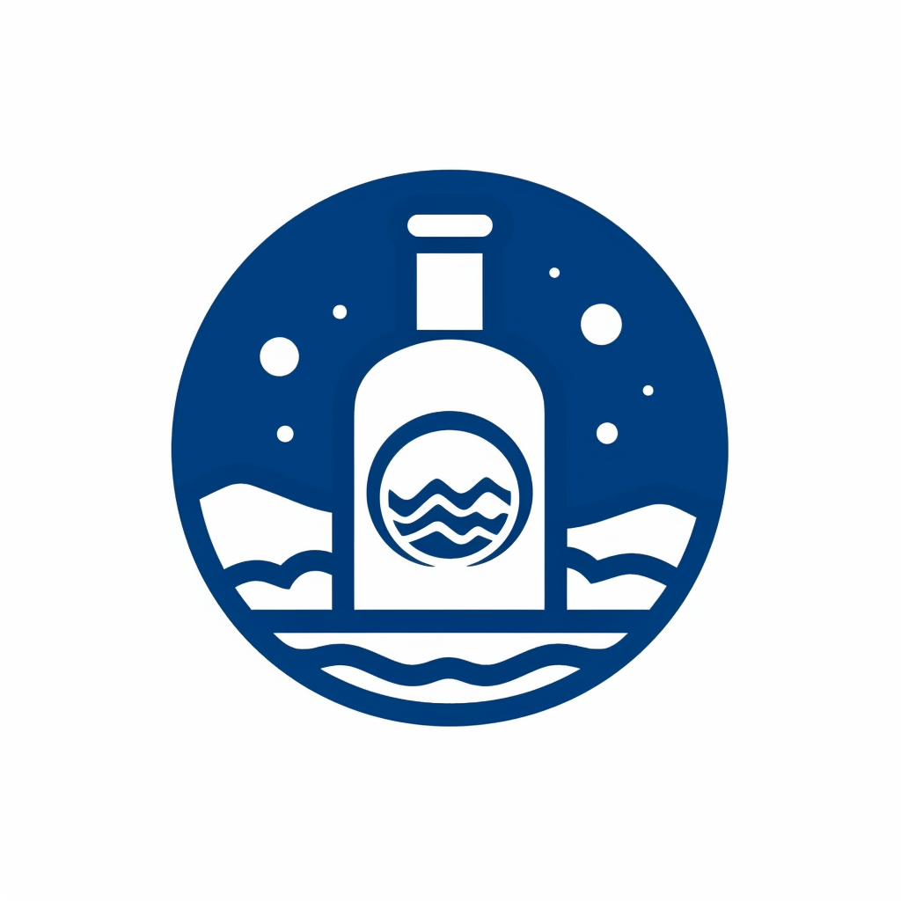

<!-- Improved compatibility of back to top link: See: https://github.com/nhlong27/dengueapp/pull/73 -->
<a id="readme-top"></a>

<!-- PROJECT SHIELDS -->
[![Contributors][contributors-shield]][contributors-url]
[![Forks][forks-shield]][forks-url]
[![Stargazers][stars-shield]][stars-url]
[![Issues][issues-shield]][issues-url]
[![MIT License][license-shield]][license-url]
[![LinkedIn][linkedin-shield]][linkedin-url]

<!-- PROJECT LOGO -->
<br />
<div align="center">
  <a href="https://ecommerce-nhlong.vercel.app" target='_blank'>
    
  </a>

  <h3 align="center">Epicola</h3>

  <p align="center">
    An e-commerce website for beverages
    <br />
    Version: v1.0.0-alpha
    <br />
    Author: Nguyen Hoang Long 
    <br />
    Email: nhlong2706@gmail.com 
    <br />
    <a href="https://ecommerce-nhlong.vercel.app" target='_blank'>View Demo</a>
    ·
    <a href="https://github.com/nhlong27/ecommerce/issues" target='_blank'>Report Bug</a>
    ·
    <a href="https://github.com/nhlong27/ecommerce/pulls" target='_blank'>Request Feature</a>
  </p>
</div>

## Live Demo
Official website: <a href="https://ecommerce-nhlong.vercel.app/" target='_blank'>https://ecommerce-nhlong.vercel.app</a>

<!-- TABLE OF CONTENTS -->
<details>
  <summary>Table of Contents</summary>
  <ol>
    <li>
      <a href="#about">About The Project</a>
      <ul>
        <li><a href="#duration">Duration</a></li>
        <li><a href="#application-flow">Application flow</a></li>
        <li><a href="#technologies">Technologies</a></li>
      </ul>
    </li>
    <li>
      <a href="#getting_started">Getting Started</a>
    </li>
    <li><a href="#contributing">Contributing</a></li>
  </ol>
</details>


<!-- ABOUT THE PROJECT -->
<a id='about'></a>
## About the project

[![Product Preview][product-preview]](...url)

I'm intrigued by the intricacies of ecommerce site architecture, particularly when implemented with a headless CMS approach. My focus lies in crafting personalized solutions, such as building dedicated order and stock management services. I aim to create a self-sustaining ecosystem where payment processing relies on trusted Saas solutions like Stripe's checkout and webhook integration.

Regarding data management, my strategy involves web scraping from websites, a method I find effective, especially for dynamic data sources like those associated with companies like PepsiCo. However, given the volatility of this data, I'm keen on establishing a scheduled cron job that fetches new information and efficiently pushes it into Kafka topics.

To maintain data consistency and provide real-time updates, I intend to employ a separate service that consumes the data from Kafka and seamlessly updates the MongoDB database. This way, the backend remains robust and always reflects the latest information, ensuring a smooth experience for users and streamlined operations for the ecommerce platform.

<a id='duration'></a>
## Duration

June - July 2023 
## Application flow  
<!-- <b>Note</b>: media = movie | TV shows -->
<ul>
  <li>User signs up/ signs in with credentials / signs in with Google provider
  </li>
  <li>User edits profile information
  </li>
  <li>User browses product catalogue, searches for product by <i>keyword</i>, <i>filter options (category, brand, price range, sort by best rated, most reviewed)</i> 
  </li>
  <li>User views product details: <i>images</i>, <i>description</i>, <i>price</i>, <i>in stock</i>, etc.
  <li>User adds products to cart
  <li>User checkouts
  <li>User pays for their order
  <li>User views order history and payment details
  <li>User leaves reviews for products</li>
</ul>

<a id='technologies'></a>
<h2>Technologies</h2>

<ul>
  <li>Client: Next/TS + Tailwind (shadcn), Redux</li>
  <li>Server: JWT-based Next-Auth, Next api + graphql (zod), prisma/PostgreSQL, mongoose/MongoDB, Redis, Kafka pub/sub service + cron job</li>
  <li>Services: Stripe checkout, webhook</li>
  <li>Deployment: Vercel, Railway.app, AWS S3</li>
</ul>

<p align="right">(<a href="#readme-top">back to top</a>)</p>

<!-- GETTING STARTED -->
<a id='getting_started'></a>
## Getting Started

0. Find data source to populate the Product collection in MongoDB
1. Clone the repo.
   ```sh
   git clone https://github.com/nhlong27/movieSite
   ```
2. Install NPM packages
   ```sh
   cd ./client && npm install *** (cd ./server && npm i)
   ```
3. Add env variables. Point MONGO_URL to your own MongoDB data source. As for Stripe webhook integration, consider reading https://stripe.com/docs/webhooks
    ```js
    NEXT_PUBLIC_SERVER 
    NEXT_PUBLIC_DATA_SOURCE (beginning of product image uri) 
    NEXT_PUBLIC_S3_BUCKET
    GOOGLE_ID
    GOOGLE_SECRET
    NEXTAUTH_SECRET
    DATABASE_URL (postgresql)
    MONGO_URL
    REDIS_URL
    STRIPE_SECRET_KEY
    NEXT_PUBLIC_STRIPE_PUBLISHABLE_KEY
    STRIPE_WEBHOOK_SECRET
    AWS_ACCESS_KEY_ID
    AWS_SECRET_ACCESS_KEY
    AWS_BUCKET_NAME
    ```

If you have any troubles please either create an issue or email me. Or message me here: (link to be added)
<p align="right">(<a href="#readme-top">back to top</a>)</p>


<!-- CONTRIBUTING -->
<a id='contributing'></a>
## Contributing

Contributions are what make the open source community such an amazing place to learn, inspire, and create. Any contributions you make are **greatly appreciated**.

If you have a suggestion that would make this better, please fork the repo and create a pull request. You can also simply open an issue with the tag "enhancement".
Don't forget to give the project a star! Thanks again!

1. Fork the Project
2. Create your Feature Branch (`git checkout -b feature/AmazingFeature`)
3. Commit your Changes (`git commit -m 'Add some AmazingFeature'`)
4. Push to the Branch (`git push origin feature/AmazingFeature`)
5. Open a Pull Request


See the [open issues](https://github.com/nhlong27/movieSite/issues) for a full list of proposed features (and known issues).


<p align="right">(<a href="#readme-top">back to top</a>)</p>


<!-- MARKDOWN LINKS & IMAGES -->

<!-- https://www.markdownguide.org/basic-syntax/#reference-style-links -->
[contributors-shield]: https://img.shields.io/github/contributors/nhlong27/movieSite.svg?style=for-the-badge
[contributors-url]: https://github.com/nhlong27/movieSite/graphs/contributors
[forks-shield]: https://img.shields.io/github/forks/nhlong27/movieSite.svg?style=for-the-badge
[forks-url]: https://github.com/nhlong27/movieSite/network/members
[stars-shield]: https://img.shields.io/github/stars/nhlong27/movieSite.svg?style=for-the-badge
[stars-url]: https://github.com/nhlong27/movieSite/stargazers
[issues-shield]: https://img.shields.io/github/issues/nhlong27/movieSite.svg?style=for-the-badge
[issues-url]: https://github.com/nhlong27/movieSite/issues
[license-shield]: https://img.shields.io/github/license/nhlong27/movieSite.svg?style=for-the-badge
[license-url]: https://github.com/nhlong27/movieSite/blob/master/LICENSE.txt
[linkedin-shield]: https://img.shields.io/badge/-LinkedIn-black.svg?style=for-the-badge&logo=linkedin&colorB=555
[linkedin-url]: https://www.linkedin.com/in/long-nguyen-95517b250/

<!-- Screenshots -->
[product-preview]: public/screenshots/product-preview.png

<!-- Frameworks/libraries -->
[React-badge]: https://img.shields.io/badge/React-20232A?style=for-the-badge&logo=react&logoColor=61DAFB
[React-url]: https://reactjs.org/
[Vite-badge]: https://img.shields.io/badge/vite-%23646CFF.svg?style=for-the-badge&logo=vite&logoColor=white
[Vite-url]: https://vitejs.dev/
[TailwindCSS-badge]: https://img.shields.io/badge/tailwindcss-%2338B2AC.svg?style=for-the-badge&logo=tailwind-css&logoColor=white
[TailwindCSS-url]: https://tailwindcss.com/
[Jotai-badge]: https://img.shields.io/badge/-Jotai-white?style=for-the-badge
[Jotai-url]: https://jotai.org/
[NodeJS-badge]: https://img.shields.io/badge/node.js-6DA55F?style=for-the-badge&logo=node.js&logoColor=white
[NodeJS-url]: https://nodejs.org/en/
[MongoDB-badge]: https://img.shields.io/badge/MongoDB-4EA94B?style=for-the-badge&logo=mongodb&logoColor=white
[MongoDB-url]: https://www.mongodb.com/
[ExpressJS-badge]: 	https://img.shields.io/badge/Express.js-404D59?style=for-the-badge
[ExpressJS-url]: https://expressjs.com/
[Zustand-badge]: https://img.shields.io/badge/-zustand-orange
[Zustand-url]: https://github.com/pmndrs/zustand
[Typescript-badge]: https://img.shields.io/badge/TypeScript-007ACC?style=for-the-badge&logo=typescript&logoColor=white
[Typescript-url]: https://www.typescriptlang.org/
[Zod-badge]: https://img.shields.io/badge/-zod-blue
[Zod-url]: https://zod.dev/
